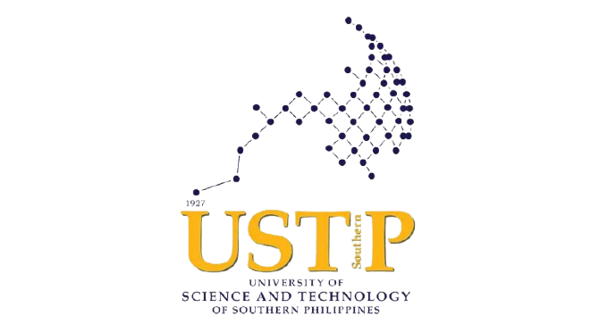
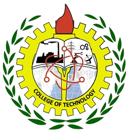

# ESP32 Templates & Examples

Welcome to the **ESP32-Templates** repository! This is a curated collection of ESP32 and ESP32-CAM examples, templates, and projects.

  
  
  
  
  
  
  
  
  
  

---

### 🏛️ Affiliation & Author

   &nbsp;&nbsp;
   &nbsp;&nbsp;
  

 

**Javier G. Siliacay** is a developer from **USTP-CDO** under the **College of Technology (COT)**, specifically in the **Autotronics Department**.

- **Author:** [Javier G. Siliacay](https://github.com/JavierSiliacay)
- **Facebook:** [Javier Siliacay](https://www.facebook.com/siliacayjavier)
- **Institution:** University of Science and Technology of Southern Philippines (USTP)
- **Campus:** Cagayan de Oro (CDO)
- **Department:** Autotronics, College of Technology

---

## 📂 Repository Contents
This collection was originally sourced from various open-source snippets and organized into templates and reference material for future projects.

- **`ESP32_Examples/`**: Contains all sketches and projects.
  - **AI & Vision**: Gemini Vision, OpenAI integration, and AmebaPro2 examples.
  - **Connectivity**: MQTT, Bluetooth (BLE), WebServers, and Telegram Bot integrations.
  - **IoT Services**: Line Notify, Google Sheets logging, and Firebase.
  - **Hardware Control**: Motor control (OTTO), Servo, TFT Displays (ILI9341), and sensors (DHT11, MLX90615).
  - **Utilities**: Firmware templates, SD card management, and NTP time syncing.

## 🛠️ Development Environment
To use these templates, ensure you have the following set up:
- **Arduino IDE** (Latest version recommended)
- **Arduino core for the ESP32** (Installed via Boards Manager)
- Relevant libraries for specific examples (e.g., `WiFi.h`, `HTTPClient.h`, `ArduinoJson.h`, etc.)

---

## 🙌 Credits & Acknowledgments
Special thanks to my friend, a hardware enthusiast specializing in tools like the Flipper Zero, for the inspiration and technical insights provided for these projects. Note that I am unable to share his GitHub profile or name as his repositories contain various illegal devices and restricted hardware tools, such as jammers.

---
*Developed for the USTP Autotronics Community and the open-source electronics community.*

---

### 🌐 Connect with Me

  
  &nbsp;
  

